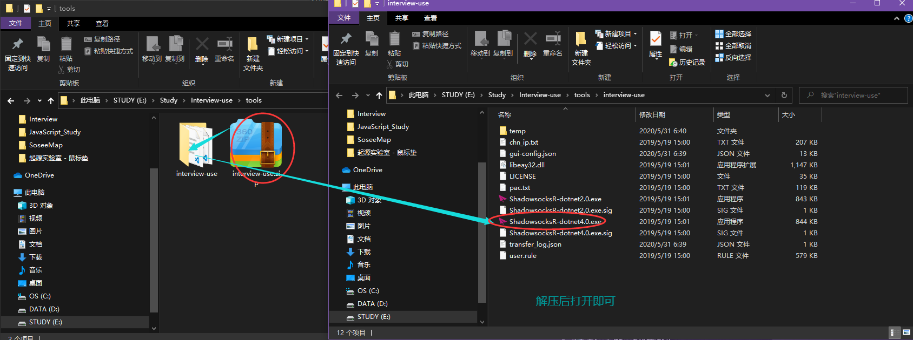

<h1> 提供工具仅限用于，浏览面试作品 </h1>
<h2>科学上网( 有效期2020.5.31~2020.7.31 - 注意仅限用于浏览面试作品使用 )</h2>
<pre>
    使用步骤:
        0. 下载工具：进入tools目录下载"SSR.zip"压缩包
        1. 运行工具:  
        2. 访问作品: 
           a) 打开谷歌浏览器访问<a href="https://crwn-live-react-shopping.herokuapp.com/" target="_blank" >https://crwn-live-react-shopping.herokuapp.com/</a>即可查看作品完整功能
           b) 作品源码: <a href="#" target="_blank" >https://github.com/ZTaer/React-ReduxSagas-shopping</a>
        3. 作品特点: 
            a) 支持谷歌以及邮箱注册/登陆，并保存购物车数据到GoogleFirebase
</pre>